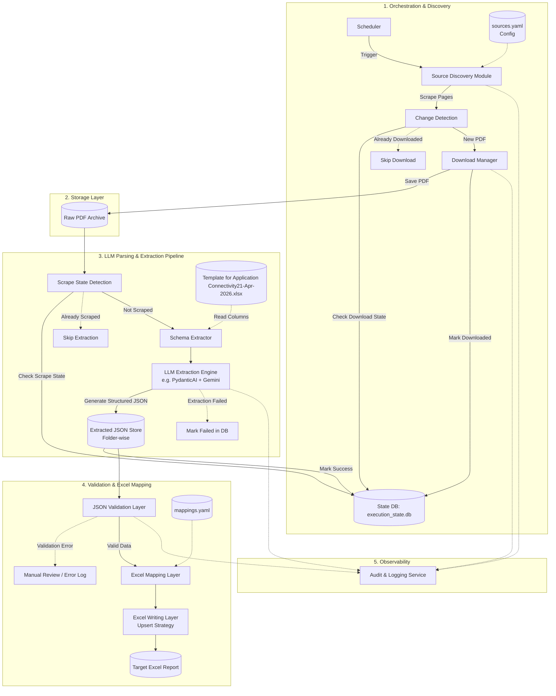

# System Architecture: Automated PDF Extraction & Excel Mapping Pipeline

## 1. Executive Summary
This architecture defines a highly robust, modular, end-to-end pipeline to automate the discovery, downloading, parsing, and mapping of complex PDF reports from external portals (CTUIL, CEA) into a unified master Excel workbook. Rather than utilizing a brittle "single-pass" scraper, the system is engineered using a decoupled architecture characterized by source-specific adapters, incremental processing, and a declarative mapping core.

## 2. Complete Sheet Mapping Definition
The pipeline routes parsed data into specific Excel sheets originating from targeted online reports.

| Target Sheet Name | Source URL | Document Type / Identifier |
| :--- | :--- | :--- |
| **Data to be captured sheet** | https://ctuil.in/ists-consultation-meeting<br>https://ctuil.in/ists-joint-coordination-meeting | CMETS PDF<br>JCC Meetings PDF |
| **Bulk consumer sheet** | https://ctuil.in/ists-consultation-meeting | CMETS PDF |
| **Margin sheet** | https://ctuil.in/renewable-energy/ | Status of margin available at ISTS substations for future RE integration |
| **Transformer capacity sheet**| https://ctuil.in/renewable-energy/ | Status of allocation of bays at ISTS substations for connectivity grantees |
| **Element status sheet** | https://cea.nic.in/transmission-reports/?lang=en<br>https://cea.nic.in/comm-trans/national-committee-on-transmission/?lang=en<br>https://cea.nic.in/transmission-reports/?lang=en | TBCB, RTM<br>NCT<br>CMETS |
| **RE Potential** | https://www.ctuil.in/renewable-energy<br>https://www.ctuil.in/renewable-energy<br>https://cea.nic.in/psp_a_i/transmission-system... | Connectivity Margin in ISTS RE Substations available by Mar-2030<br>Status of margins available at existing ISTS substations for proposed RE integration<br>Transmission system for integration of over 500 gw non-fossil-capacity |
| **Non RE proposed RE integration**| https://www.ctuil.in/renewable-energy | Connectivity margins at existing ISTS (non RE) substations for future RE integration |

---

## 3. High-Level System Architecture



---

## 4. Sub-System Details

### 4.1. Source Registry & Change Detection Layer
*   **Source Registry (`sources.yaml`):** Acts as a master config containing the source name, type, URL, expected file patterns, parser strategy, and the target sheet name.
*   **Change Detection:** Downloads are resource-intensive. This layer checks the page for current PDF links, utilizing file sizes, ETags, Last-Modified headers, or document checksums. Files are **only** downloaded if the document is new or changed. Filenames alone are never trusted as they are frequently reused by portals.

### 4.2. Download Manager
*   **Mechanics:** Isolated module focusing on robust HTTP interactions (retry logic, timeouts, concurrency, duplicate prevention).
*   **Raw Storage:** Files are stored deterministically before any processing occurs: `raw/<source_name>/<yyyy>/<mm>/<original_filename>.pdf`.
*   **Metadata DB:** Alongside the PDF, a SQLite or Postgres database logs the source URL, extraction timestamp, hash, and status to ensure traceability.

### 4.3. LLM Document Classification & Extraction Engine
*   **Scrape State Detection:** Before parsing, the database is checked to verify if the PDF has already been successfully scraped. If yes, extraction is skipped. If the LLM extraction fails, it is marked as "failed" in the DB.
*   **Dynamic Schema Extraction:** The system reads the target column names directly from `Template for Application Connectivity21-Apr-2026.xlsx` to dynamically construct the extraction schema.
*   **LLM Extraction (PydanticAI/Gemini):** Rather than fragile regex rules, an LLM is guided by the dynamic schema to extract specific fields accurately.
*   **JSON Storage:** The LLM's structured output is immediately saved as a JSON file, organized in folders matching the raw PDFs. This provides a raw, auditable record of exactly what the LLM extracted.

### 4.4. Mapping, Validation & Excel Output
*   **JSON Validation:** The extracted JSON files are rigorously validated against business rules (e.g., required fields, numeric constraints) before writing to Excel. Errors are flagged without corrupting the target sheet.
*   **Declarative Mapping (`mappings.yaml`):** Maps validated JSON elements strictly to the output Excel templates. It defines duplicate resolution strategies per sheet.
*   **Upsert Writing:** The system uses unique identifiers to safely update existing rows or append genuinely new records, preserving historical consistency.

### 4.5. Audit and Observability Layer
Maintains comprehensive logs for source checks, download successes/failures, parsing results, validation warnings, and OCR fallback utilization. Ties everything to a unique `run ID` and extraction timestamp for debugging.

---

## 5. Technology Stack
*   **Language:** Python
*   **Web Automation / Discovery:** Playwright or Requests + BeautifulSoup
*   **Downloads:** `aiohttp` for async HTTP requests
*   **LLM & Extraction Schema:** PydanticAI + Gemini (or OpenAI) for intelligent, schema-bound text extraction from PDFs based on Excel headers.
*   **Data Manipulation & Excel:** `pandas`, `openpyxl`, or `xlsxwriter`
*   **Metadata & State Store:** SQLite (`execution_state.db`) for tracking download state, success, and failures.
*   **Intermediate Data Store:** Folder-wise JSON files representing raw LLM output.

---

## 6. Recommended Folder Structure
```text
project_root/
├── config/
│   ├── sources.yaml          # URL to Source configuration
│   └── mappings.yaml         # Parser to Excel Schema mappings
├── raw_pdfs/
│   └── <source_name>/        # Untouched downloaded PDFs
├── extracted_json/           # Folder-wise JSON output from LLM
│   └── <source_name>/        # e.g., json matching each PDF name
├── output/
│   ├── master_workbook.xlsx  # Final user-facing output
│   └── Template for Application Connectivity21-Apr-2026.xlsx
├── logs/
│   └── execution.log
├── state/
│   └── execution_state.db    # SQLite metadata (downloaded, scraped, failed)
└── src/
    ├── discover.py           # Change detection & URL finding
    ├── download.py           # Download manager & deduplication check
    ├── schema_reader.py      # Reads columns from Excel template
    ├── llm_extractor.py      # PydanticAI/Gemini extraction logic
    ├── validate.py           # Validates the extracted JSON
    ├── map_to_excel.py       # Upsert logic & workbook writing
    └── orchestrator.py       # Main execution & scheduling
```

## 7. Recommended Implementation Sequence
To avoid getting bogged down in edge cases, development should proceed in this order:
1.  **Source Registry & Change Detection:** Validate that URLs can be monitored without downloading.
2.  **Downloader & Raw Archive:** Ensure robust saving and deduplication.
3.  **Single Sheet Adapter:** Build a parser, validation, and Excel writer for *one* specific sheet (e.g., Bulk Consumer Sheet) end-to-end.
4.  **Orchestration & Logging:** Tie the single pipeline together with the scheduler.
5.  **Scale Adapters:** Add the remaining sources one-by-one utilizing the established shared core pipeline.
